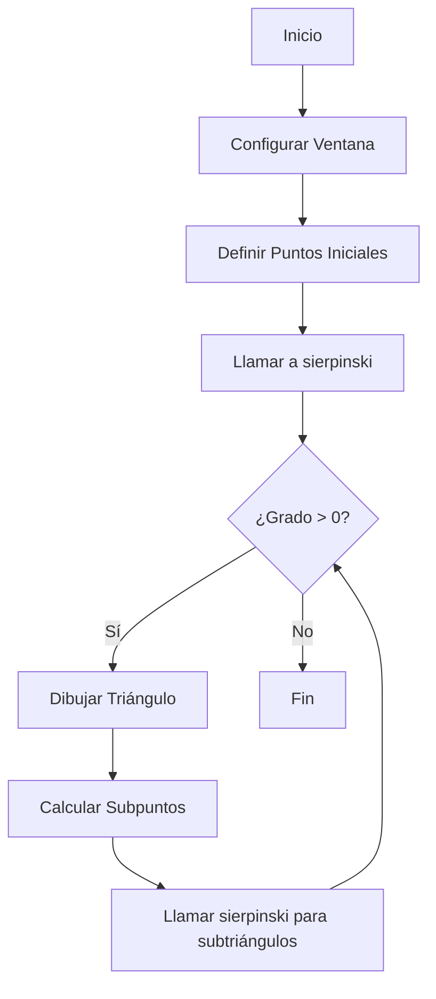

# 🔺 Triángulo de Sierpinski Colorido 🎨


## 📖 Descripción

Este proyecto genera un hermoso Triángulo de Sierpinski utilizando Python y la biblioteca Turtle. El Triángulo de Sierpinski es un fractal fascinante que crea patrones complejos a partir de formas simples.

## 🚀 Características

- 🌈 Colores aleatorios para cada triángulo
- 🖼️ Visualización en pantalla completa
- ⚡ Renderizado rápido
- 🔢 Profundidad del fractal ajustable

## 🛠️ Tecnologías Utilizadas

- Python 3.x
- Biblioteca Turtle
- Módulo Random

## 💻 Cómo Funciona

1. **Inicialización**: Configura una ventana de Turtle y define los puntos iniciales del triángulo.

2. **Dibujo de Triángulos**: La función `draw_triangle()` dibuja un triángulo dado tres puntos y un color.

3. **Cálculo de Puntos Medios**: `get_midpoint()` calcula el punto medio entre dos puntos dados.

4. **Recursión**: La función `sierpinski()` dibuja el fractal de manera recursiva:
   - Dibuja el triángulo actual
   - Se llama a sí misma para los tres sub-triángulos
   - Se detiene cuando alcanza el grado de profundidad especificado

5. **Ejecución**: La función `main()` inicia el proceso y maneja la configuración de la ventana.

## 📊 Diagrama de Flujo



## 🎨 Resultado

El resultado es un colorido Triángulo de Sierpinski que muestra la belleza de los fractales matemáticos.


## 🔧 Cómo Usar

1. Asegúrate de tener Python instalado.
2. Ejecuta el script:
   ```
   python sierpinski_triangle.py
   ```
3. Disfruta del espectáculo fractal! 🎉

## 🔬 Experimentos

Prueba a cambiar estos valores para diferentes resultados:
- Ajusta la profundidad del fractal en la llamada a `sierpinski()` en `main()`
- Modifica la lista de colores en `sierpinski()`
- Cambia los puntos iniciales para diferentes formas de triángulos

## 📚 Más Información

Para aprender más sobre el Triángulo de Sierpinski y otros fractales, visita:
- [Triángulo de Sierpinski en Wikipedia](https://es.wikipedia.org/wiki/Tri%C3%A1ngulo_de_Sierpinski)
- [Fractales en Matemáticas](https://www.matematicascercanas.com/2017/04/fractales-en-matematicas.html)


