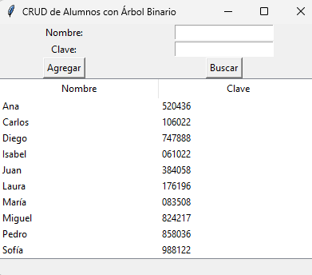
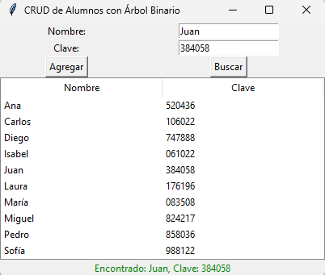

# :robot: Motor de Búsqueda con Árbol Binario :robot:

Este proyecto implementa un pequeño motor de búsqueda utilizando un árbol binario para almacenar y buscar términos. La aplicación permite agregar, buscar y visualizar datos de alumnos en una interfaz gráfica.

## :ghost: Características :ghost:

- Implementación de un árbol binario de búsqueda para almacenar datos de alumnos.
- Interfaz gráfica para interactuar con el árbol binario.
- Funcionalidades para agregar y buscar alumnos.
- Visualización de los datos en una tabla ordenada alfabéticamente.
- Carga inicial de 10 alumnos con datos predeterminados.

## :eye: Requisitos :eye:

- Python 3.x
- Tkinter (generalmente viene preinstalado con Python)

## :teacher: Instalación :teacher:

1. Clona este repositorio o descarga el archivo `busqueda.py`.
2. Asegúrate de tener Python 3.x instalado en tu sistema.

## :factory: Uso :factory:

1. Ejecuta el script `busqueda.py`:

```
python busqueda.py
```

2. La aplicación se abrirá mostrando la interfaz gráfica.
3. Puedes agregar nuevos alumnos utilizando los campos de entrada y el botón "Agregar".
4. Para buscar un alumno, ingresa el nombre en el campo correspondiente y haz clic en "Buscar".
5. La tabla mostrará todos los alumnos ordenados alfabéticamente.

##  :clock11: Estructura del Proyecto :clock11:

- `busqueda.py`: Contiene todo el código del proyecto, incluyendo la implementación del árbol binario y la interfaz gráfica.

## :zap: Capturas de Pantalla :zap:

## :goberserk: Capturas de Pantalla :goberserk:




## :joystick: Contribuir :joystick:

Si deseas contribuir a este proyecto, por favor:

1. Haz un fork del repositorio.
2. Crea una nueva rama para tu funcionalidad (`git checkout -b feature/AmazingFeature`).
3. Haz commit de tus cambios (`git commit -m 'Add some AmazingFeature'`).
4. Push a la rama (`git push origin feature/AmazingFeature`).
5. Abre un Pull Request.


